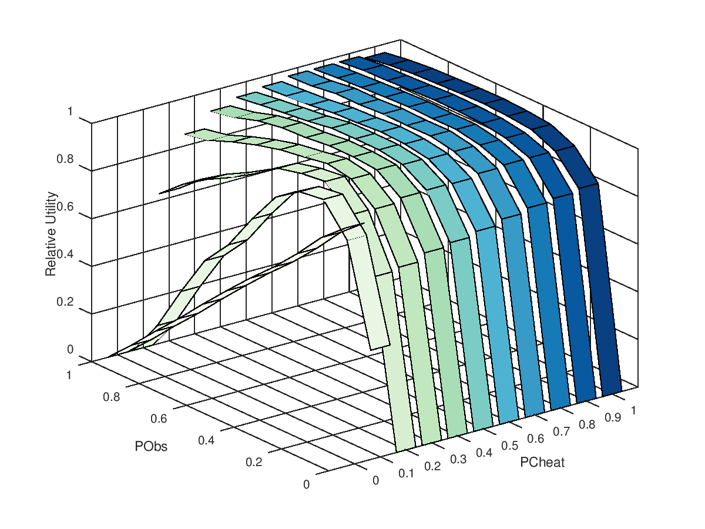

<!-- ## Introduction -->

<!--   + Resource allocation problem, layered solution -->
<!--   + Pathologies of modern systems -->
<!--   + The dilemma of the rules -->
<!--     - on one hand, rules should be sufficiently unrestricted to -->
<!--       allow 'freedom of (collective) action' -->
<!--     - on the other, sufficiently restricted to resist the 'iron law of -->
<!--       oligarchy' -->

<!--   + Self-governing socio-techincal systems: -->
<!--     - rule-oriented systems -->
<!--     - self-organising systems -->
<!--     - value-sensitive systems -->
<!--   + "These values may not even be explicitly referenced by the rules, -->
<!--     but *values and rules should still be aligned*" -->

<!-- ## Aim -->

<!-- - Use knowlege management strategies as approach to deal with resource allocation problem -->

# Introduction
## Self-Governing Socio-technical Systems

- Self-governing socio-techincal systems:
  - rule-oriented systems
  - self-organising systems
  - value-sensitive systems
- These values may not even be explicitly referenced by the rules,
  but *values and rules should still be aligned*

. . .

<!-- \begin{block}{The dilemma of the rules} -->
### The Dilemma of the Rules
- on one hand, rules should be sufficiently unrestricted to allow 'freedom of (collective) action'
- on the other, sufficiently restricted to resist the 'iron law of oligarchy'
<!-- \end{block} -->

## Common-Pool Resource (CPR) Management

- \alert{Resource allocation} in open systems, common in socio-technical scenarios (smart-grids, cloud computing, sharing economy)

- \alert{Institutions}, deal with challenges such as economy of scarcity, cooperation and regulation (Ostrom)

- \alert{Computational Justice}, seek to achieve fair solutions, specially in exceptional situations (e.g. economy of scarcity)

<!-- ## Knowledge Pathologies -->

<!-- - Unequal distribution of knowledge -->
<!-- - Dominance of information sources, elimination of diversity -->
<!-- - Asymmetric distribution of power -->
<!-- - Ownership of means of coordination diminishing opportunity for collective action -->
<!-- - Establishment and maintenance of agreed conventions to satisfy/satisfice a shared set of congruent values -->
<!-- - Tendency towards oligarchy -->

# Knowledge Management Processes
## Knowledge Management in Classical Athens

\columnsbegin
\column{0.6\textwidth}

- Openness, transparency and inclusivity
- Greater social benefits derived from higher levels of cooperation
- Capacity for resolving public collective action problems
- Participatory and deliberation model of self-governance

<!-- ## Democratic and Sustainable Self-Governing Socio-Technical-Systems -->

<!-- - Operational, Governance and Knowledge Management Layer -->

\column{0.4\textwidth}

{ width=100% }

\columnsend

## Knowledge Management Processes

## Knowledge Management Processes - Knowledge Aggregation

<!-- ## Democratic and Sustainable Self-Governing Socio-Technical-Systems -->

<!-- - Operational, Governance and Knowledge Management Layer -->

\columnsbegin
\column{0.6\textwidth}

\

\column{0.4\textwidth}

**Knowledge Aggregation:**

\setlength{\leftmargini}{0.5em}
\begin{itemize}
\item Incentives for knowledgeable individuals to pool their knowledge for the benefit of the group
\item Cost of communication sufficiently low to overcome the imposition of getting information from "where it was" to "where it needed to be"
\item Sorting processes sifting false information from true and sifting useful and irrelevant information
\end{itemize}

\columnsend

## Knowledge Management Processes - Knowledge Alignment

\columnsbegin
\column{0.6\textwidth}

\

\column{0.4\textwidth}

**Knowledge Alignment:**

- Choice
- Informed Leader
- Commitment-following

\columnsend

## Knowledge Management Processes - Knowledge Codification

\columnsbegin
\column{0.6\textwidth}

\

\column{0.6\textwidth}

**Knowledge Codification:**
\begin{itemize}
\item Written laws or decrees
\item Stable to allow confident planning, but also sufficiently fluid to avoid ossification and allow introspective improvement by amendment
\end{itemize}

\columnsend

## KM layer design principles
\resizebox{\textwidth}{\textheight}{%
\begin{minipage}{1.3\textwidth}
\begin{enumerate}
\item Clear boundaries (as per Ostrom) between who is a citizen/participant in knowledge aggregation and alignment processes, and who is not.
\item Processes generally aim to lower transaction costs, and increase aggregate value of social cooperation.
\item Agreement on certain matters on which decisions must be made as being of common interest (e.g. security, welfare of all within widest boundary).
\item Clear line between common interest questions and factional or partial goods questions. Appropriate procedural rules for decision-making in each domain.
\item Common knowledge by citizens of substantive rules and of procedural rules for making new rules and revising existing rules.
\item Epistemic diversity among citizens, along with distributed social knowledge of locus of expertise and reliability of experts.
\item Procedural rules ensure that valuable, diverse inputs are recognized as such and taken up as appropriate. Filtering process for assessing what (and whose) information input is (and is not) relevant to each specific sort of question.
\item Processes serve as focal points/bright lines for collective action by citizens against violations and specify a hierarchy of possible punishments depending on seriousness of violation.
\end{enumerate}
\end{minipage}}

# Formal Model
## Knowledge Management for Self-Organised Resource Allocation

<!-- \columnsbegin -->
<!-- \column{0.6\textwidth} -->

<!-- \column{0.4\textwidth} -->
- \alert{Voices:} Opinion formulation and diffusion;
- \alert{Distributive Justice:} Allocation policies definition;
- \alert{Flexible Monitoring and Sanctioning:} Appropriate response for non-compliance;

<!-- \columnsend -->

## LPG' Game

- Over time, players acknowledge resources need ($q$) and generation ($g$);
   - Economy of scarcity: $g_i < q_i$
- Through a common-pool of resources, agents contribute part of their resources ($p_i$) and disclose a demand ($d_i$);
- Resources are distributed to players ($r$), following allocation rules;
- Possibility of non-compliance: $p_i \leq g_i; d_i \geq q_i; r'_i \geq r_i$

{ width=75% }

# Results

# Voices of Justice

## Motivation
\begin{block}{}
\emph{6. Epistemic diversity among citizens, along with distributed social knowledge of locus of expertise and reliability of experts.}
\end{block}

\columnsbegin
\column{0.3\textwidth}

\column{0.7\textwidth}

- How to conciliate the different players' voices?
- How to weight different opinions
- "Not only must justice be done; it must also be seen to be done"
- How to deal with disagreement in the perception of fairness, e.g. a context might satisfy one part of a group, but infuriate the rest.

\columnsend

## Motivation
\begin{tikzpicture}[remember picture,overlay]
    \node[xshift=1.0cm,yshift=1.0cm,opacity=.9] at (current page.south west) {\includegraphics[width=0.13\textwidth]{img/voicesthumb.pdf}};
\end{tikzpicture}
<!-- \begin{tikzpicture}[remember picture,overlay] -->
<!--     \node[xshift=-1cm,yshift=1.5cm,opacity=.9] at (current page.south east) {\includegraphics[width=0.12\textwidth]{img/voicesthumb.pdf}}; -->
<!-- \end{tikzpicture} -->

\begin{block}{}
\emph{6. Epistemic diversity among citizens, along with distributed social knowledge of locus of expertise and reliability of experts.}
\end{block}

- Diversity \to\ variety of behaviour and opinions
- Distributed social knowledge \to\ information diffusion / convergence processes
- Locus of expertise \to\ different network topologies, clustering
- Reliability of experts \to\ Trust / affinity function guiding influence and information diffusion

\vfill

## Strategy
\begin{tikzpicture}[remember picture,overlay]
    \node[xshift=1.0cm,yshift=1.0cm,opacity=.9] at (current page.south west) {\includegraphics[width=0.13\textwidth]{img/voicesthumb.pdf}};
\end{tikzpicture}

<!-- \columnsbegin -->
<!-- \column{0.7\textwidth} -->

1. **Opinion Formation** - agent opinions are formulated, based on individual experience;
2. **Trust** - agents observe their environment and, through comparison, define its trusts;
3. **Influence** - agents communicate and diffuse opinions through their social influence.

<!-- \column{0.3\textwidth} -->

<!-- { width=80% } -->
\begin{figure}
\includegraphics[width=0.8\textwidth]{img/algdiagram.pdf}
\centering
\end{figure}

<!-- \columnsend -->

## Strategy
\begin{tikzpicture}[remember picture,overlay]
    \node[xshift=1.0cm,yshift=1.0cm,opacity=.9] at (current page.south west) {\includegraphics[width=0.13\textwidth]{img/voicesthumb.pdf}};
\end{tikzpicture}

\columnsbegin
\column{0.5\textwidth}

\

\column{0.5\textwidth}

**Trust:**

1. Affinity
$$
\tau_{ij}(t) = 1 - \frac{1}{1 + e^{-k(|\boldsymbol{\bar\phi_{N_i}(t) - \phi_j(t)} | - \epsilon_0)}}
$$

2. Memory
$$
T_{ij}(t) = (1 - \gamma) \cdot T_{ij} \left ( t-1 \right ) +  \gamma \cdot \tau_{ij}(t)
$$

\medskip

**Influence:**
$$
\phi_i(n) = \sum_{j \in \mathcal{N}_i} T_{ij} \phi_j(n-1)
$$

\columnsend

## Voices Results
\begin{tikzpicture}[remember picture,overlay]
    \node[xshift=1.0cm,yshift=1.0cm,opacity=.9] at (current page.south west) {\includegraphics[width=0.13\textwidth]{img/voicesthumb.pdf}};
\end{tikzpicture}

1. *Coherence* - Can the solution identify and distinguish fair and unfair allocation schemes?

2. *Robustness* - Are there mechanisms able to avoid the influence of malicious agents trying to propagate false information?

3. *Resilience* - Does it work properly in different topologies and with topology changes?

## Voices Results - Coherence

\begin{figure}
    \centering
    \captionsetup{justification=centering}
    \begin{subfigure}[b]{0.48\textwidth}
        \includegraphics[width=\textwidth]{img/voices_exp1_rotation.pdf}
    \end{subfigure}
    ~ %add desired spacing between images, e. g. ~, \quad, \qquad, \hfill etc.
    \begin{subfigure}[b]{0.48\textwidth}
        \includegraphics[width=\textwidth]{img/voices_exp1_clique_first.pdf}
    \end{subfigure}

    \begin{subfigure}[b]{0.48\textwidth}
        \includegraphics[width=\textwidth]{img/voices_exp1_random_order.pdf}
    \end{subfigure}
    ~
    \begin{subfigure}[b]{0.48\textwidth}
        \includegraphics[width=\textwidth]{img/voices_exp1_ration.pdf}
    \end{subfigure}
    \caption{Mean opinon for different allocation methods. Propagation ensures more reliable and convergent final opinion.}
\end{figure}

## Voices Results - Robustness

{ width=45% } { width=45% }

 - Malicious agents try to undermine the public opinion by consistently propagating negative feedback.
 - Trust and influence select the appropriate content

## Voices Results - Resilience

\columnsbegin

\column{0.7\textwidth}
\vfill

\

{ width=90% }

{ width=90% }

\column{0.3\textwidth}

Despite same number of connections, small-world network enables locus of information, creating overall better knowledge of the system's state.

\columnsend

# Distributed Distributive Justice

## Motivation
\begin{exampleblock}{}
\emph{7. Procedural rules ensure that valuable, diverse inputs are recognized as such and taken up as appropriate. Filtering process for assessing what (and whose) information input is (and is not) relevant to each specific sort of question.}
\end{exampleblock}

\columnsbegin[b]
\column{0.3\textwidth}

\column{0.7\textwidth}
- How to evaluate multiple inputs to legislate a resource allocation policy?
- How to discern between relevant and irrelevant inputs in the decision making?
- How to achieve fairness in resource allocation policies?

\columnsend

## Motivation
\begin{tikzpicture}[remember picture,overlay]
    \node[xshift=0.7cm,yshift=1.0cm,opacity=.9] at (current page.south west) {\includegraphics[width=0.13\textwidth]{img/distributivethumb.pdf}};
\end{tikzpicture}

\begin{block}{}
\emph{7. Procedural rules ensure that valuable, diverse inputs are recognized as such and taken up as appropriate. Filtering process for assessing what (and whose) information input is (and is not) relevant to each specific sort of question.}
\end{block}

\begin{itemize}
\item Procedural rules \to\ resource allocation policy making, claim and responses for resources
\item Valuable, diverse input recognised as such \to\ Rescher's legitimate claims
\item Filtering process assessing (ir)relevant information \to\ Trust, reputation, affinity
\end{itemize}

## Strategy
\begin{tikzpicture}[remember picture,overlay]
    \node[xshift=0.7cm,yshift=1.0cm,opacity=.9] at (current page.south west) {\includegraphics[width=0.13\textwidth]{img/distributivethumb.pdf}};
\end{tikzpicture}

\columnsbegin
\column{0.4\textwidth}

\begin{figure}
  \centering
  \resizebox{!}{0.8\textheight}{%
  \begin{sequencediagram}
    \newthread{A}{Non-head}{}
    \newinst[1]{N}{Neighbour}{}
    \newinst[1]{B}{Head}{}

    \begin{call}{A}{\shortstack{Opinion\\formation}}{A}{}\end{call}
    \postlevel
    \begin{call}{A}{\shortstack{Trust\\assessment}}{A}{}\end{call}
    \postlevel
    \begin{call}{A}{\shortstack{Trust\\propagation}}{N}{\shortstack{Update Trust}}\end{call}
    \postlevel
    \begin{call}{A}{\shortstack{Opinion and trusts ($\Phi_i$, $T_i$)}}{B}{Allocation $r_i$}
        \postlevel
        \begin{call}{B}{\shortstack{Compute\\allocation order}}{B}{}
        % \postlevel
        \end{call}
    % \postlevel
    \end{call}
  \end{sequencediagram}
  }
\end{figure}

\column{0.6\textwidth}

1. Personal opinion formation (legitimate claims of justice)
2. Comparison to the environment (trust)
3. Information exchange and trust update
4. Allocation guided by reputation

\columnsend

## Strategy - Personal Opinion Formation (legitimate claims of justice)
\begin{tikzpicture}[remember picture,overlay]
    \node[xshift=1.0cm,yshift=0.9cm,opacity=.9] at (current page.south west) {\includegraphics[width=0.13\textwidth]{img/distributivethumb.pdf}};
\end{tikzpicture}

Legitimate Claims of Justice:

\begin{table}[t]
\resizebox{\textwidth}{!}{%
\begin{tabular}{|l|l|}
\hline
\multicolumn{1}{|l|}{\multirow{3}{*}{Canons of equality}} &  $\phi_{i}^{1}(S) = \frac{ \sum_{t=0}^S r_i(t)}{S}$ \\ \cline{2-2}
\multicolumn{1}{|l|}{}                               & $\phi_{i}^{2}(S) = \frac{ \sum_{t=0}^S \left ( r_i(t) > 0 \right )}{S}$  \\ \cline{2-2}
\multicolumn{1}{|l|}{}                               &  $\phi_{i}^{3}(S) =
                                                          \begin{cases}
                                                          (1 - \alpha) \cdot \phi_{i}^{3}(S-1) +  \alpha & \text{if } r_i(S) \geq d_i(S)\\
                                                          (1 - \beta) \cdot \phi_{i}^{3}(S-1)  & \text{if } r_i(S) < d_i(S)
                                                        \end{cases}$ ~~~~~~~~~~\qquad \qquad \\ \hline
Canon of needs                                       &  $\phi_{i}^{4}(S) = \frac{ \sum_{t=0}^S d_i(t)}{S}$ \\ \hline
Canon of productivity                                &  $\phi_{i}^{5}(S) = \frac{ \sum_{t=0}^S p_i(t)}{S}$ \\ \hline
Canon of effort                                      &  $\phi_{i}^{6}(S) = S$ \\ \hline
Canon of social utility                              &  $\phi_{i}^{7}(S) = \frac{ \sum_{t=0}^S \mathbbm{I}(head(t) = i)}{S}$\\ \hline
Canon of supply and demand~~~~                        & $\phi_{i}^{8}(S) = \frac{ \sum_{t=0}^S \mathbbm{I}(p_i(t) = g_i(t) \land d_i(t) = q_i(t) \land r'_i(t) = r_i(t))}{S}$  \\ \hline
\end{tabular}%
}
\end{table}

<!-- - Individual opinion vector: -->
<!-- $$  \Phi_{i}(t) = \left \{\phi_{i}^{1}, \phi_{i}^{2}, \phi_{i}^{3}, \dots , \phi_{i}^{8} \right \} = \left \{\phi^{c}_{i} : c \in |\mathcal{C}| \right \}$$ -->

<!-- - Individual aggregated opinion: -->
<!-- $$\phi_i(t) = \sum_c \frac{1}{|\mathcal{C}|} \cdot \phi_{i}^{c}(t)$$ -->
\vfill

## Strategy - Trust Assessment and Propagation
\begin{tikzpicture}[remember picture,overlay]
    \node[xshift=0.7cm,yshift=1.0cm,opacity=.9] at (current page.south west) {\includegraphics[width=0.13\textwidth]{img/distributivethumb.pdf}};
\end{tikzpicture}

\columnsbegin
\column{0.4\textwidth}

\begin{figure}
  \centering
  \resizebox{!}{0.8\textheight}{%
  \begin{sequencediagram}
    \newthread{A}{Non-head}{}
    \newinst[1]{N}{Neighbour}{}
    \newinst[1]{B}{Head}{}

    \begin{call}{A}{\shortstack{Opinion\\formation}}{A}{}\end{call}
    \postlevel
    \begin{call}{A}{\shortstack{Trust\\assessment}}{A}{}\end{call}
    \postlevel
    \begin{call}{A}{\shortstack{Trust\\propagation}}{N}{\shortstack{Update Trust}}\end{call}
    \postlevel
    \begin{call}{A}{\shortstack{Opinion and trusts ($\Phi_i$, $T_i$)}}{B}{Allocation $r_i$}
        \postlevel
        \begin{call}{B}{\shortstack{Compute\\allocation order}}{B}{}
        % \postlevel
        \end{call}
    % \postlevel
    \end{call}
  \end{sequencediagram}
  }
\end{figure}

\column{0.6\textwidth}

Trust formulation:
$$
T_{ij}(0) = f(\text{affinity}(i,j), \text{memory}(i,j))
$$

Trust Propagation:
$$
T'_{ij}(t) = \frac{\sum_{k \in N_{ij}} T_{ik}(t) T_{kj}(t)}{\sum_{k \in N_{ij}} T_{ik}(t)}
\label{propagation}
$$
<!--     where: -->
<!-- $$N_{ij} = \left ( N(i) \cap N(j) \right ) \cup \{i\} - \{j\}$$ -->

\columnsend

## Distributed Justice Results
\begin{tikzpicture}[remember picture,overlay]
    \node[xshift=1.0cm,yshift=1.0cm,opacity=.9] at (current page.south west) {\includegraphics[width=0.13\textwidth]{img/distributivethumb.pdf}};
\end{tikzpicture}

1. *Efficiency* - can the solution efficiently distribute resources under full compliance?

2. *Fairness* - does the solution guarantee fair allocations in case of non-compliance?

3. *Robustness* - what is the effect of changing network topology and behaviour?

## Distributive Justice Results - Efficiency

\columnsbegin
\column{0.7\textwidth}

\column{0.35\textwidth}

- Agents more in need are prioritized, resulting in a stable and egalitarian
distribution.

\columnsend

## Distributive Justice Results - Fairness
\columnsbegin
\column{0.7\textwidth}

<!-- { width=50% } -->

\column{0.4\textwidth}

- Non-compliant agents are not trusted, therefore do not receive resources and
eventually leave the cluster.

\columnsend

## Distributive Justice Results - Robustness
\columnsbegin
\column{0.7\textwidth}

\column{0.4\textwidth}

\begin{itemize}
\item Below 50\%: non-compliancy is opposed even with few connections;
\item Above 50\%: non-compliancy becomes the 'rule', but can not produce an
  enduring allocarion to all agents.
\end{itemize}

\columnsend

# Flexible Monitoring and Sanctioning

## Motivation
\begin{block}{}
\emph{8. Processes serve as focal points/bright lines for collective action by citizens against violations and specify a hierarchy of possible punishments depending on seriousness of violation.}
\end{block}

\columnsbegin[b]
\column{0.3\textwidth}

\column{0.7\textwidth}
- How to respond to transgressions?
- What is the best procedure to deal with non-compliance?
- How to ensure diversity and flexibility in open systems?

\columnsend

## Motivation
\begin{tikzpicture}[remember picture,overlay]
    \node[xshift=1.0cm,yshift=1.0cm,opacity=.9] at (current page.south west) {\includegraphics[width=0.13\textwidth]{img/pvpthumb.pdf}};
\end{tikzpicture}

\begin{block}{}
\emph{8. Processes serve as focal points/bright lines for collective action by citizens against violations and specify a hierarchy of possible punishments depending on seriousness of violation.}
\end{block}

- Processes against violations \to\ Monitoring and sanctioning mechanisms
- Hierarchy of punishments depending on seriousness of violation \to\ Principled Violation of Policy

## Strategy
<!-- \begin{tikzpicture}[remember picture,overlay] -->
<!--     \node[xshift=1.0cm,yshift=1.0cm,opacity=.9] at (current page.south west) {\includegraphics[width=0.13\textwidth]{img/pvpthumb.pdf}}; -->
<!-- \end{tikzpicture} -->

\medskip
\vfill

<!-- ## Strategy -->
<!-- \columnsbegin -->
<!-- \column{0.6\textwidth} -->

<!-- \ -->

<!-- \column{0.4\textwidth} -->

<!-- \begin{block}{Agents' Behavioural Parameters:} -->

<!-- \begin{itemize} -->
<!-- \item \alert{PCheat:} probability of non-cooperative behaviour -->
<!-- \item \alert{PObs:} frequency of monitoring for non-compliant events -->
<!-- \item \alert{PForg:} probability of not issuing a sanction upon an observed non-compliant event -->
<!-- \end{itemize} -->
<!-- \end{block} -->

<!-- \columnsend -->

## Flexible Monitoring and Sanctioning Results
\begin{tikzpicture}[remember picture,overlay]
    \node[xshift=1.0cm,yshift=1.0cm,opacity=.9] at (current page.south west) {\includegraphics[width=0.13\textwidth]{img/pvpthumb.pdf}};
\end{tikzpicture}

1. Cost-effective monitoring
2. Hierarchy of punishments
3. Flexible monitoring and sanctioning
4. Justice perception and policy justification

<!-- - $n=30$ agents -->
<!-- - $g_i = \text{rand}(0,1)$; $q_i = g_i + (1-g_i)*\text{rand}(0,1)$ -->
<!-- - Monitoring Cost: $0.05/\text{observation}$ -->
<!-- - Sanction: agent is removed of the game for $m=10$ rounds -->
<!-- - Random allocator -->
<!-- - Utility function: -->

<!-- $$ -->
<!--  U_i = -->
<!--   \begin{cases} -->
<!--   a(q_i) + b(R_i - q_i) & \text{if } R_i \geq q_i\\ -->
<!--   a(R_i) - c(q_i - R_i) & \text{otherwise} -->
<!--   \end{cases} -->
<!-- $$ -->

<!-- $$ -->
<!-- \text{with}~~ R_{i} = r'_{i} + (g_{i} - p_{i}) -->
<!-- $$ -->

## Flexible Monitoring and Sanctioning Results - Cost-effective Monitoring

\columnsbegin
\column{0.7\textwidth}

<!-- { width=50% } -->
<!--  -->

\column{0.3\textwidth}

If monitoring has costs, depending on the levels of non-compliance ($PCheat$), increasing the monitoring frequency ($PObs$) has small or negative effect on general utility.

\columnsend

## Flexible Monitoring and Sanctioning Results - Hierarchy of Punishments

\columnsbegin
\column{0.7\textwidth}

\column{0.3\textwidth}

<!-- When levels of non-compliance ($PForg$) are low, punishment can be counter-productive, as it might not distinguish accidents and might exclude collaborative agents. -->

In scenarios with low levels of non-compliance ($PForg$), higher utility is achieved by letting eventual non-compliant agents participate in the game, than excluding them through sanctioning.

\columnsend

## Flexible Monitoring and Sanctioning Results - Adaptable Policies

\columnsbegin
\column{0.7\textwidth}

\column{0.3\textwidth}

Compared to fixed policy strategies, flexible strategy (reinforcement, in graph) is able to achieve overall better results, for different scenarios of non-compliance.

\columnsend

## Flexible Monitoring and Sanctioning Results - Justice Perception

\columnsbegin
\column{0.7\textwidth}

\column{0.3\textwidth}

In scenarios where PVP is learned and exercised, agents with high levels of cooperation receive proportionally less sanctions than the ones who do not cooperate as often.

\columnsend

# Discussion and Conclusions

## Summary of results

- **Common Pool Resources Management** problem in self-governing socio-technical systems requires robust, resilient and adaptive solutions;
- Open and transparent **Knowledge Management Processes**, inspired by classical Athenian democracy, give principles on how communication and collective decision processes should be conducted;
- Experimental results are practical implementations of principles 7, 8, 9:
  - \alert{Voices} - distributed social knowledge and epistemic diversity for assessment of system fairness;
  - \alert{Distributed Distributive Justice} - procedure rules to ensure that requests for resources are evaluated. Trust and reputation act as filtering processes for assessing the relevance of different requests;
  - \alert{Flexible Monitoring and Sanctioning} - processes for collective action against violations and non-compliance, with hierarchy of punishments depending on the seriousness of violation.

<!-- ## Discussion / Future Works -->

<!-- - Towards \[feasible\] socio-techincal systems; -->
<!-- -  -->

## Acknowledgemnts

- National Council for Scientific and Technological Development (CNPq), Brazil

\begin{figure}
\centering
\includegraphics[width=0.3\textwidth]{cnpq.png}
\end{figure}

\begin{figure}
\centering
\includegraphics[width=0.3\textwidth]{csf.png}
\end{figure}

## {.standout}

Thank you!

<!-- <\!-- -->
<!-- TODO: -->
<!-- - Discussion session -->
<!-- - referencia Ostrom, Ober and Rescher -->
<!-- - review intro -->
<!-- - review athens part -->
<!-- -\-> -->
