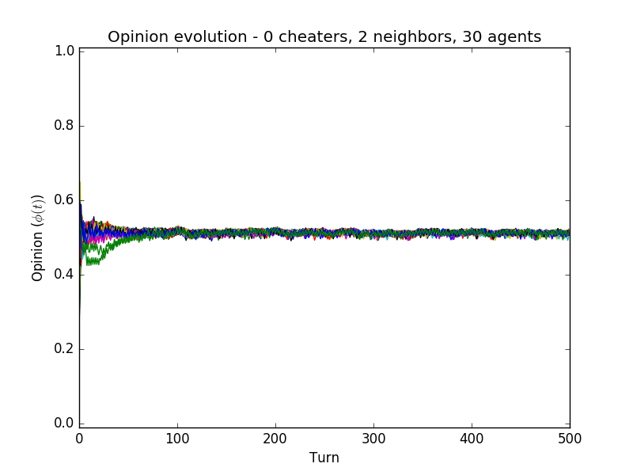
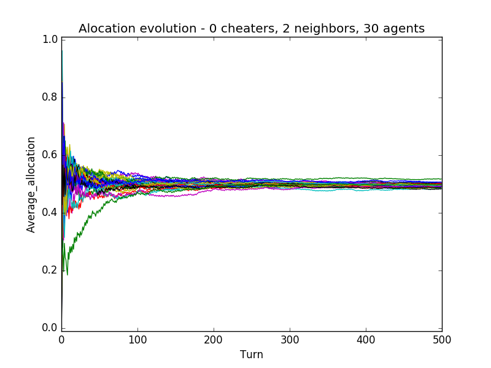
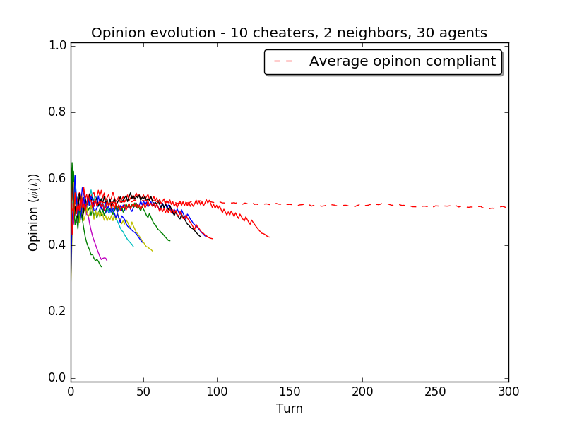
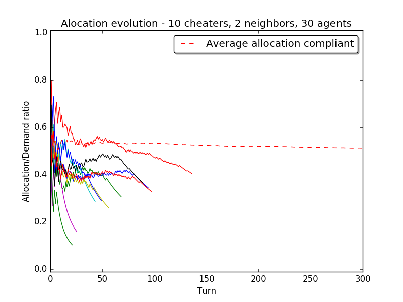
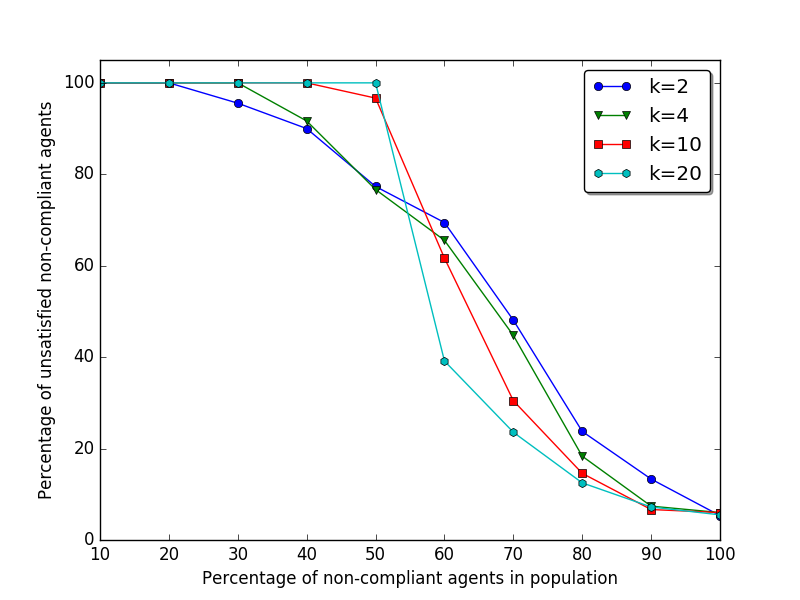

# Introduction

## Introduction - Resource Allocation in Open Systems

The prevalence of open systems -- e.g. smart grids, cellular networks and cloud computing -- is driving a demand for 'better' solutions to a standard **resource allocation problem**:

- How to collectivise and distribute a set of common-pool resources, considering
    - Fairness
    - Inclusivity
    - Sustainability

- How to overcome problems such as
    - No centralised authority
    - No full disclosure
    - Economy of scarcity

## Computational Justice

- How resources can be distributed in a \alert{fair} manner?
    - How to **prioritise** requests?
    - What **fairness criteria** should be considered when judging merit (equality, equity, proportionallity, ...)
    - How to **avoid abuses** in the system (*free-riding*, deceiving, non-compliancy)   

. . .

**Towards a Computational Justice framework**

- Centuries of experience in the context of social organisations can be transfered to new and current technical systems;
- Not only concerned with solution's efficiency, but also aspects such as "correctness", "appropriateness" and "acceptability".

###
Solutions both generic and yet flexible, and both efficient and yet effective.

<!-- ## Distributive Justice

- How resources can be distributed in a **fair** manner?

- What **fairness criteria** to use to distribute the resources?
    - Egalitarian: maximise satisfaction of most disadvantaged agents;
    - Envy-free: no agent prefers the allocation of any other agent;
    - Proportional: all agents receive the same share;
    - Equitable: each agent derives the same utility;
    - ... -->

## Experimental Setting - LPG$'$ Game
<!-- Citar Pitt no titulo do slide -->
\begin{block}{}
Linear Public Game creating a scenario where agents receive resources independently and can decide to cooperate or not.
\end{block}
- $n$ agents share an environment with scarce resources and strive to persist on it for as long as possible
- At each timestep (turn) $t$, each agent:
    - Determines the resources it has **available**, $g_i \in [0,1]$
    - Determines its **need** for resources, $q_i \in [0,1]$
        - (In an economy of scarcity, $q_i > g_i$)
    - Makes a **demand** for resources, $d_i \in [0,1]$
    - Makes a **provision** of resources, $p_i \in [0,1]$ ($p_i \leq g_i$)
    - Receives an **allocation** of resources (defined externally), $r_i \in [0,1]$
    - Makes an **appropriation** of resources, $r'_i \in [0,1]$
- If $p_i = g_i \land d_i = q_i \land r'_i = r_i$ we say that an agent is complying with the game; otherwise it is considered non-compliant.

# Towards a Distributive Justice Framework

## Former Solution: *DJ*

- Consider different metrics to evaluate fairness

- Formalisation of Nicholas Rescher's **legitimate claims of justice**

\columnsbegin

\column{0.5\textwidth}

\begin{figure}
  \centering
  \resizebox{\linewidth}{!}{%
  \begin{sequencediagram}
    \newthread{A}{Non-Head}{}
    \newinst[1]{B}{Head}{}
    \begin{call}{A}{Inform $d_i$, $p_i$}{B}{\shortstack{Claims\\rankings}}
        \begin{call}{B}{\shortstack{Compute legitimate claims\\and Borda Points}}{B}{}
        % \postlevel
        \end{call}
    % \postlevel
    \end{call}
    \postlevel
    \begin{call}{A}{\shortstack{Sort favourite\\claims}}{A}{}\end{call}
    \postlevel
    \begin{call}{A}{\shortstack{Vote on claims\\weights}}{B}{Allocation $r_i$}
        \postlevel
        \begin{call}{B}{\shortstack{Compute functions weights\\and allocation order}}{B}{}
        % \postlevel
        \end{call}
    % \postlevel        
    \end{call}
  \end{sequencediagram}
  }
\end{figure}

\column{0.5\textwidth}

- Four-way algorithm:
    1. Agents inform a 'head' demands and provisions;
    2. Head ranks agents according to different criteria (legitimate claims);
    3. Agents vote on criteria to be prioritized;
    4. Head, considering criteria weights and agents condition, decide an order of allocation.

\columnsend

<!-- ## Merits and Problems of Previous Solution

- Merits:
    - Formalisation of **legitimate claims of justice**
    - Mitigates effects of **free-riding**

- Problems:
    - Centralisation of processes around head
    - Voting in large systems is impractical
    - Turn-based game embedded in allocation method -->

## Distributed Distributive Justice (DDJ)

- Maintain the formalisation of Rescher's legitimate claims as a plural metric for fairness;
- Develop a trust and reputation framework, allowing the computation of priorities and needs in a decentralised and independent way.
- Steps:
    1. Personal opinion formation (legitimate claims of justice)
    2. Comparison to the environment (trust)
    3. Information exchange and trust update
    4. Allocation guided by reputation

## Personal Opinion Formation (legitimate claims of justice)

\begin{table}[t]
\resizebox{\textwidth}{!}{%
\begin{tabular}{|l|l|}
\hline
\multicolumn{1}{|l|}{\multirow{3}{*}{Canons of equality}} &  $\phi_{i}^{1}(S) = \frac{ \sum_{t=0}^S r_i(t)}{S}$ \\ \cline{2-2}
\multicolumn{1}{|l|}{}                               & $\phi_{i}^{2}(S) = \frac{ \sum_{t=0}^S \left ( r_i(t) > 0 \right )}{S}$  \\ \cline{2-2}
\multicolumn{1}{|l|}{}                               &  $\phi_{i}^{3}(S) =
                                                          \begin{cases}
                                                          (1 - \alpha) \cdot \phi_{i}^{3}(S-1) +  \alpha & \text{if } r_i(S) \geq d_i(S)\\
                                                          (1 - \beta) \cdot \phi_{i}^{3}(S-1)  & \text{if } r_i(S) < d_i(S)
                                                        \end{cases}$ ~~~~~~~~~~\qquad \qquad \\ \hline
Canon of needs                                       &  $\phi_{i}^{4}(S) = \frac{ \sum_{t=0}^S d_i(t)}{S}$ \\ \hline
Canon of productivity                                &  $\phi_{i}^{5}(S) = \frac{ \sum_{t=0}^S p_i(t)}{S}$ \\ \hline
Canon of effort                                      &  $\phi_{i}^{6}(S) = S$ \\ \hline
Canon of social utility                              &  $\phi_{i}^{7}(S) = \frac{ \sum_{t=0}^S \mathbbm{I}(head(t) = i)}{S}$\\ \hline
Canon of supply and demand~~~~                        & $\phi_{i}^{8}(S) = \frac{ \sum_{t=0}^S \mathbbm{I}(p_i(t) = g_i(t) \land d_i(t) = q_i(t) \land r'_i(t) = r_i(t))}{S}$  \\ \hline
\end{tabular}%
}
\end{table}

- Individual opinion vector:
$$  \Phi_{i}(t) = \left \{\phi_{i}^{1}, \phi_{i}^{2}, \phi_{i}^{3}, \dots , \phi_{i}^{8} \right \} = \left \{\phi^{c}_{i} : c \in |\mathcal{C}| \right \}$$

- Individual aggregated opinion:
$$\phi_i(t) = \sum_c \frac{1}{|\mathcal{C}|} \cdot \phi_{i}^{c}(t)$$

## Comparison to the Environment (Trust Formulation)

\columnsbegin
\column{0.7\textwidth}

- Accordance index:

$$\tau_{ij}(t) = \text{diff}(\bar\phi_{N_{i}-j}(t), ~\phi^{c}_j(t))$$
$$\bar\phi_{N_i-j}(t) = \frac{\sum_{n \in N(i) \cap \{i\} - \{j\}} \phi_n(t)}{|N(i)|+1} $$

\column{0.4\textwidth}
\begin{block}{Principles}
  \begin{enumerate}
  \item Trust more those who say coherent things (according to yourself!)
  \item It takes time to change an impression
  \end{enumerate}
\end{block}
\columnsend
- Trust:
$$
T_{ij}(t) =
 \begin{cases}
 0.0   & \text{if }j \notin N(j)\\
 (1 - \gamma)  T_{ij} \left ( t-1 \right ) +  \gamma  \tau_{ij}(t) & \text{if } i \neq j \land j \in N(j)\\
 1.0  & \text{if } i = j
 \end{cases}
 $$

## Information Exchange and Trust Update

\begin{block}{}
Update trust, based on common neighbours' trusts
\end{block}

- Iterative process:
$$
T'_{ij}(t) = \frac{\sum_{k \in N_{ij}} T_{ik}(t) T_{kj}(t)}{\sum_{k \in N_{ij}} T_{ik}(t)}
\label{propagation}
$$
    where:
$$N_{ij} = \left ( N(i) \cap N(j) \right ) \cup \{i\} - \{j\}$$

## Allocation guided by reputation

\begin{block}{}
Define final metrics to perform allocation
\end{block}

- Reputation index:
$$ R_i(t) = \frac{1}{|N_{i}|} \sum_{j \in N_{i}} T_{ji}(t) $$

- Urgency index:
$$ U_i(t) = R_i(t) * (1-\Phi_i(t)) $$

## Algorithm summary

\columnsbegin
\column{0.4\textwidth}

\begin{figure}
  \centering
  \resizebox{!}{0.8\textheight}{%
  \begin{sequencediagram}
    \newthread{A}{Non-head}{}
    \newinst[1]{N}{Neighbour}{}
    \newinst[1]{B}{Head}{}

    \begin{call}{A}{\shortstack{Opinion\\formation}}{A}{}\end{call}
    \postlevel
    \begin{call}{A}{\shortstack{Trust\\assessment}}{A}{}\end{call}
    \postlevel
    \begin{call}{A}{\shortstack{Trust\\propagation}}{N}{\shortstack{Update Trust}}\end{call}
    \postlevel
    \begin{call}{A}{\shortstack{Opinion and trusts ($\Phi_i$, $T_i$)}}{B}{Allocation $r_i$}
        \postlevel
        \begin{call}{B}{\shortstack{Compute\\allocation order}}{B}{}
        % \postlevel
        \end{call}
    % \postlevel        
    \end{call}
  \end{sequencediagram}
  }
\end{figure}

\column{0.6\textwidth}
<!-- \begin{block}{}
- Computation is made locally, just transmitting a 'veredict' to the head
- Self-moderation of opinions and trusts
\end{block} -->
\begin{itemize}
\item Computation is made locally, just transmitting a 'veredict' to the head
\item Self-moderation of opinions and trusts
\end{itemize}
\columnsend

# Results and Analysis

## Self Organising Allocation

\columnsbegin
\column{0.7\textwidth}

<!-- { width=50% } -->

\column{0.3\textwidth}

- Agents more in need are prioritized, resulting in a stable and egalitarian
distribution.

\columnsend

## Dealing With Non-compliant Behaviour

\columnsbegin
\column{0.7\textwidth}

<!-- { width=50% } -->

\column{0.4\textwidth}

- Non-compliant agents are not trusted, therefore do not receive resources and
eventually leave the cluster.

\columnsend

<!-- ## Comparison of Results

\begin{table}
\centering
\caption{Comparison of results between DJ and DDJ.}
\label{comp_results}
\begin{tabular}{llllll}
\hline
\textbf{Strategy} & \textbf{ut. C} & \textbf{ut. NC} & \textbf{r. C} & \textbf{r. NC} & \textbf{fairness C} \\ \hline
\multicolumn{6}{l}{\textit{\textbf{DJ (baseline)}}}                                                \\
\qquad het01             & $147 \pm 24$   & $-3 \pm 43$     & 20            & 7              & $1.59 \pm 0.54$     \\
\qquad hom01             & $124 \pm 5$    & n/a             & 30            & n/a            & $0.74 \pm 0.13$     \\
\qquad hom04             & $124 \pm 4$    & n/a             & 29            & n/a            & $0.83 \pm 0.21$     \\
\multicolumn{6}{l}{\textit{\textbf{DDJ}}}                                         \\
\qquad het01             & $140 \pm 7$   & $-30 \pm 4.9 $     & 20            & 0              & $0.78 \pm  0.29 $     \\
\qquad hom01             & $124 \pm 5$   & n/a             & 30            & n/a            & $0.60 \pm 0.07$     \\
\qquad hom04             & $124 \pm 5$   & n/a             & 30            & n/a            & $0.62 \pm 0.08$    
\end{tabular}
\end{table} -->

## Exploring Effects of Connectivity

\columnsbegin
\column{0.7\textwidth}

\column{0.4\textwidth}

\begin{itemize}
\item Below 50\%: non-compliancy is opposed even with few connections;
\item Above 50\%: non-compliancy becomes the 'rule', but can not produce an
  enduring allocarion to all agents.
\end{itemize}

\columnsend

# Conclusion

## Final Remarks

- Presented solution demonstrate that it is possible to define \alert{fair policies of resource allocation} in environments characterized by decentralisation, scarcity and no full information disclosure, using independent agents' accounts.

- Lessons learned:
    - Independent subjective assessment of justice can be considered, if inserted into a context of **influence** and **trust**;
    - Authority emerges from **reputation** autonomously;
    - Ability to aggregate individual, subjective assessments, into **collective, objective facts**.

- Future steps:
    - Explore asynchronous game;
    - Distributed pool of resources;
    - Collective mechanisms of verification.

## Acknowledgemnts

- National Council for Scientific and Technological Development (CNPq), Brazil;

- Diverse colaborators.

\begin{figure}
\centering
\includegraphics[width=0.3\textwidth]{cnpq.png}
\end{figure}

\begin{figure}
\centering
\includegraphics[width=0.3\textwidth]{csf.png}
\end{figure}

## {.standout}

Thank you!
