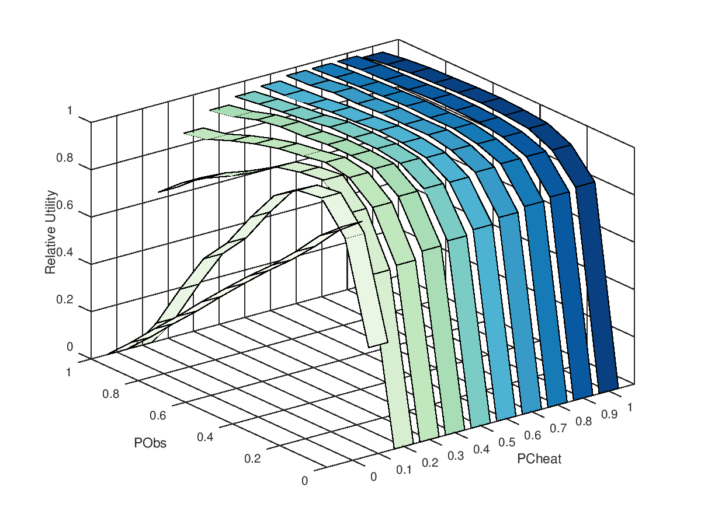

# Introduction

## Motivation

- **Rules and norms** in open systems attempt to guarantee its well functioning and prevent selfish (e.g. free-riding) or unsustainable (e.g. tragedy of the commons) behaviour.
- **Sanctioning** structures prevent and punish non-compliance enforcing conformity.
- To what extent sanctioning strategies really have **beneficial effects** in socio-technical systems?
- In what extent full norm compliance is a desirable outcome and at what **cost**?

## Layers of Society Simulation

## Principled Violation of Policy

\begin{block}{Definition}
The active and intentional decision of an agent of not applying a policy to which it is entitled.
\end{block}

In norm-governed systems, PVP is the **potential to suspend or relax controlling and retaliation mechanisms**, at the adjudicator's discretion.

# Experiments

## Formal Model - $LPG'$ Game with sanctions and forgiveness

## Game$

- Agents produce and consume resources
- Cooperation to a common-pool is voluntary
- Inidividual resources are allocated from the common-pool

## Norms

1. Agents must provide its whole generation to the common pool (i.e.\ $p_i = g_i$)
2. Agents must demand only what they need ($d_i = q_i$)
3. Agents must appropriate only what was assigned to them ($r_i = r'_i$)

## Sanctioning System

- **Penalty:** At a given turn, if an agent violate any of the norms \textbf{and} a
  sanction is issued by an observing agent, the violator should not receive
  resources from the common pool for $m$ rounds;
- **Mandatory Non-Repudiation:** once a sanction is issued, it can not
  be rejected and should be applied immediately;
- **Selective Non-Application:** an observing agent has the flexibility
  to apply or not a sanction, given a violation (this being the definition of PVP).

## Agents Behavioural Parameters

- **PCheat:** probability of non-cooperative behaviour
- **PObs:** frequency of monitoring for non-compliant events
- **PForg:** probability of not issuing a sanction upon an observed non-compliant event

## Formal Model

# Results and Analysis

## Setup

- $n=30$ agents
- $g_i = \text{rand}(0,1)$; $q_i = g_i + (1-g_i)*\text{rand}(0,1)$
- Monitoring Cost: $0.05/\text{observation}$
- Sanction: agent is removed of the game for $m=10$ rounds
- Random allocator
- Utility function:

$$
 U_i =
  \begin{cases}
  a(q_i) + b(R_i - q_i) & \text{if } R_i \geq q_i\\
  a(R_i) - c(q_i - R_i) & \text{otherwise}
  \end{cases}
$$

$$
\text{with}~~ R_{i} = r'_{i} + (g_{i} - p_{i})
$$

## A - PVP is cost effective

\columnsbegin
\column{0.7\textwidth}

<!-- { width=50% } -->
<!--  -->

\column{0.3\textwidth}

If monitoring has costs, depending on the levels of non-compliance ($PCheat$), increasing the monitoring frequency ($PObs$) has small or negative effect on general utility.

\columnsend

## B - PVP is tolerant and resilient to accidents

\columnsbegin
\column{0.7\textwidth}

\column{0.3\textwidth}

<!-- When levels of non-compliance ($PForg$) are low, punishment can be counter-productive, as it might not distinguish accidents and might exclude collaborative agents. -->

In scenarios with low levls of non-compliance ($PForg$), higher utility is achieved by letting eventual non-compliant agents participate of the game, than excluding them through sanctioning.

\columnsend

## C - PVP is adaptable to different scenarios and behaviours

\columnsbegin
\column{0.7\textwidth}

\column{0.3\textwidth}

Compared to fixed policy strategies, flexible strategy (reinforcement, in graph) is able to achieve overall better results, for different scenarios of non-compliance.

\columnsend

## D - PVP as a tool for justice perception

\columnsbegin
\column{0.7\textwidth}

\column{0.3\textwidth}

In scenarios where PVP is learned and exercised, agents with high levels of cooperation receive proportionally less sanctions than the ones who do not cooperate as often.

\columnsend

# Conclusion

## Final Remarks

- The Principled Policy Violation (PVP) is a pertinent and advantageous mechanism in the development of norm-governed open systems;
- PVP enable solutions that are:
    a. Cost effective;
    b. Tolerant and resilient to accidents;
    c. Adaptable to different scenarios and behaviour
    d. Used as a tool of justice perception and policy justification

- Future steps:
    - Explore  *externalities* associated to PVP (e.g. social capital, resentment, shame)
    - Investigate adaptable behaviour
    - PVP as mechanism of social change/revolution in unfair environments

## Acknowledgemnts

- National Council for Scientific and Technological Development (CNPq), Brazil;

- Diverse colaborators.

\begin{figure}
\centering
\includegraphics[width=0.3\textwidth]{cnpq.png}
\end{figure}

\begin{figure}
\centering
\includegraphics[width=0.3\textwidth]{csf.png}
\end{figure}

## {.standout}

Thank you!
