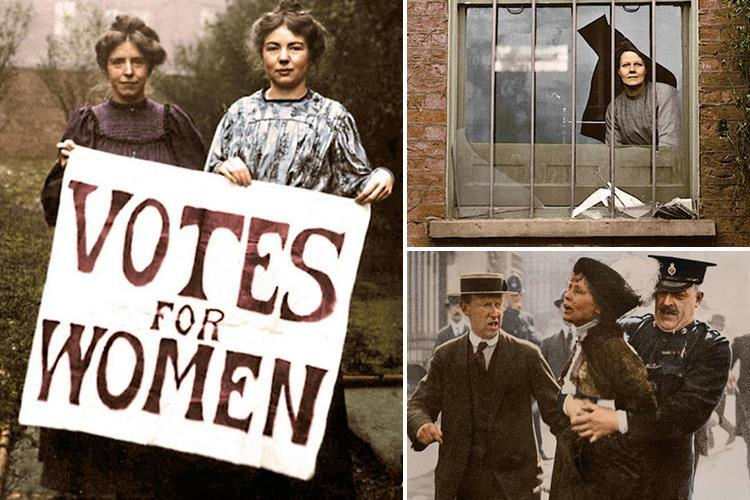

# Introduction

## Aim and Scope

> We propose that the social concept of \alert{disobedience} can be used as a
>  mechanism for \alert{adaptive and exploratory learning} in norm-governed
>  multi-agent systems.

## Disobedience in Society

\columnsbegin
\column{0.6\textwidth}

- **Disobedience** has been used historically as a form of resistance and call for change in unfair regimes.
- Among the factors that motivate widespread disobedience are:
    - **The iron law of oligarchy** - the tendency for a small group to emerge
    an run complex organisations for its own benefit, rather than the collective
    interest
    - **Principled violation of policy** - law enforcement relaxation, with
      selective common-sense non-application of sanctions

\column{0.4\textwidth}

\columnsend

## Disobedience as Learning Mechanism

\columnsbegin
\column{0.6\textwidth}

- Can these notions be applied to **norm-governed MAS**?
- How to deal with systems with **disfunctional norms**?
- Can disobedience be a form of **collective learning**, enabling the construction of adaptive systems?

\column{0.4\textwidth}

\columnsend

# Base Premises and Operationalisation

## Premises

- **Base Premises**
   - **P1** - A norm is in place
   - **P2** - Compliance is an individual decision
   - **P3** - Existence of monitoring and sanctioning mechanisms

. . .

- **Disobedience Premises**
   - **P4** - Fairness decays over time (corruption)
   - **P5** - Possibility of pardon by law enforcers

. . .

- **Transformation Premises**
   - **P6** - Prescribed ruler destitution

## Operationalisation

\columnsbegin

\column{0.2\textwidth}

{ height=50% }

\column{0.8\textwidth}

- Resource allocation scenario
- Players and its roles:
    - **Rulers** - Resource allocation policy
    - **People** - Appropration of resource
    - **Police** - Check if apppropriation = allocation

\columnsend

## Disobedience levels

<!-- ## Learnable variables -->
<!-- \begin{columns}[T] -->
<!-- \begin{column}{0.25\textwidth} -->

<!-- \textbf{Rulers} -->

<!-- \vspace{5pt} -->
<!-- $\mathbf{U}$ - Corruption of allocation policy -->

<!-- \vspace{30pt} -->

<!-- $$ -->
<!-- \scalebox{0.9}{% -->
<!-- $U = f(t)$ -->
<!-- }$$ -->

<!-- \end{column} -->

<!-- \begin{column}{0.35\textwidth} -->

<!-- \textbf{People} -->

<!-- \vspace{5pt} -->

<!-- $\mathbf{P_{Cheat}}$ - Decision of compliance as reaction of system's feedback -->

<!-- $$ -->
<!-- \scalebox{0.9}{% -->
<!-- $P_{Cheat} = f(fairness_i)$ -->
<!-- }$$ -->

<!-- $$ -->
<!--   \scalebox{0.8}{$ -->
<!--      \begin{cases} -->
<!--       \uparrow & \text{if sanctioned} \land \neg \text{fair} \\ -->
<!--       \downarrow & \text{if sanctioned} \land \text{fair} \\ -->
<!--       = & \text{if forgiven}\\ -->
<!--       \uparrow & \text{if not caught}\\ -->
<!--       \downarrow & \text{if compliant} -->
<!--      \end{cases} -->
<!--      $} -->
<!-- $$ -->

<!-- \end{column} -->
<!-- \begin{column}{0.35\textwidth} -->

<!-- \textbf{Police} -->

<!-- \vspace{5pt} -->
<!-- $\mathbf{P_{Forg}}$ - Probability of sanctioning pardon as function of perceived fairness -->

<!-- \vspace{-14pt} -->

<!-- $$ -->
<!-- \scalebox{0.9}{% -->
<!-- $P_{forg} = f(fairness)$ -->
<!-- }$$ -->

<!-- $$ -->
<!-- \scalebox{0.8}{% -->
<!-- $fairness \sim Gini(Sat)$ -->
<!-- } -->
<!-- $$ -->

<!-- \end{column} -->

<!-- \end{columns} -->

## Learning variables
<!-- \columnsbegin -->

\textbf{Rulers}: 

$\qquad \mathbf{U}$ - Corruption of allocation policy

\vspace{-20pt}
$$
\scalebox{0.8}{%
$U = f(\mathit{time})$
}$$

\vspace{-15pt}

\textbf{Police}: 

$\qquad \mathbf{P_{forg}}$ - Probability of sanction pardon as function of perceived fairness

\vspace{-20pt}

$$
\scalebox{0.8}{%
$P_{forg} = f(\mathit{fairness}) \qquad \mathit{fairness} \sim Gini(\mathit{Satisf})$
}$$

\vspace{-15pt}

\textbf{People}: 

$\qquad \mathbf{P_{Cheat}}$ - Decision of compliance as reaction of system's feedback

\vspace{-20pt}

$$
\scalebox{0.8}{%
$P_{Cheat} = f(\mathit{fairness}_i) \qquad
    \begin{cases}
    \uparrow & \text{if sanctioned} \land \neg \text{fair} \\
    \downarrow & \text{if sanctioned} \land \text{fair} \\
    = & \text{if forgiven}\\
    \uparrow & \text{if not caught}\\
    \downarrow & \text{if compliant}
    \end{cases}
    $
}$$

# Experimental Results

## Exploratory Space

\centering

{ width=75% }

<!-- TODO: also present timeline structure? -->

## Base Game

\columnsbegin
\column{0.6\textwidth}

\column{0.4\textwidth}

Without pardoning or reformation, People stay at the mercy of rulers, not having
another rational choice than to obey, no matter how unfair is the current
policy.

\columnsend

## Base Game

\columnsbegin
\column{0.6\textwidth}

\column{0.4\textwidth}

Peace:

Unjustified Disobedience:

\columnsend

## Base Game

\columnsbegin
\column{0.6\textwidth}

\column{0.4\textwidth}

Exploitation:

Oppresion:

\columnsend

## First Extension - Pardoning

\columnsbegin
\column{0.6\textwidth}

\column{0.4\textwidth}

Obedience is conditioned to unfairness level: if fair, agents obey; if
unfair, tendency to non-compliance

Police validates justified norms disobedience, pardoning transgressions

\columnsend

## First Extension - Pardoning

\columnsbegin
\column{0.6\textwidth}

\column{0.4\textwidth}

Revolution:
\newline

<!-- Agents can protest by freely demonstrating their dissatisfaction and -->
<!-- appropriating resources, restoring the environment's fairness. -->

\columnsend

## Second Extension - Reformation

- Lost of governability implies in **ruler change**
- If $\text{Non-Compliance} \geq \mathcal{T} \rightarrow \text{Reformation}$
- Set of non Rulers become the new Rulers, individual satisfaction is randomly
restarted

- 3 possible equilbibria...

## Equilibrium 1 - Reformation Cycles

\columnsbegin
\column{0.6\textwidth}

\column{0.4\textwidth}

\columnsend

- Perpetual cycle of power change
- Alternation of power and higher overall satisfaction.
- Points out the need for post-revolution reconstruction.

## Equilibrium 2 - Popular control

\columnsbegin
\column{0.6\textwidth}

\column{0.4\textwidth}

\columnsend

Knowing the Reformation Threshold $\mathcal{T}$, unfairness is manipulated so
Rulers please People with just enough resources so their disobedience remains in
controlled levels.

## Equilibrium 3 - Pragmatic revolution

\columnsbegin
\column{0.6\textwidth}

\column{0.4\textwidth}

\columnsend

People disobey just enough to guarantee that satisfaction (and resource) is the
same for all agents.

# Conclusion

## Final Remarks

- \alert{Disobedience} as tool for adaptive learning in norm-governed MAS
    - Standard norm-governed systems guarantees agents' **obedience**, but not
    **governance fairness**, allowing exploitation and oppression of agents
    - The introduction of **pardoning mechanisms** changes the system's dynamic
    equilibrium by justfifying **disobedience** as a revolutionary behaviour for
    justice restoration
    - The introduction of formal **reformation mechanisms** changes the equilibrium once
    more, giving supplementary power to non-Rulers and enabling **cycles of
    change**
    
- Open questions / Future work:
    - Could we have defined subjective terms such as *fairness*, *obedience*, *unjustified*,
        *revolution* in different ways?
    - What would happen if agents had limited or subjective knowledge of events
      happening in the network? How interpersonal factors such as *social
      influence*, *trust* and *misinformation* would affect the system?
    - How to escape from simple system reformation and move towards
      post-revolution reconstruction?

<!-- TODO: shrink!   -->

## Acknowledgemnts

- National Council for Scientific and Technological Development (CNPq), Brazil;

- Diverse colaborators.

\begin{figure}
\centering
\includegraphics[width=0.3\textwidth]{cnpq.png}
\end{figure}

\begin{figure}
\centering
\includegraphics[width=0.3\textwidth]{csf.png}
\end{figure}

## {.standout}

Thank you!
